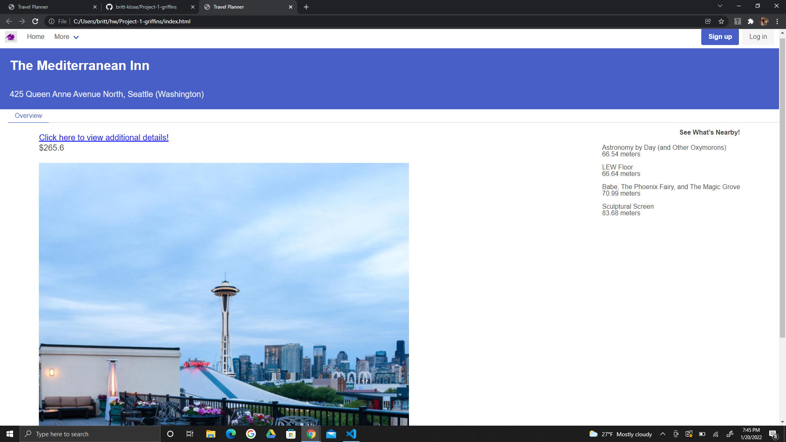

# Project-1-griffins
    Hotel Finder

# Description
- This project offers users the perfect interactive tool to help them find the right hotel for their next vacation or travel assignment. 

# User Story
- When the user opens up the page, then they are presented with the home page and search bar where they can type in a any city.
- When they hit the discover button, then the browser will use the first API call to present the user with cards of the top 6 hotels in that area to choose from. Each card will include the hotel’s name, number of stars, address, and a small picture of the hotel. 
- When a user clicks on a hotel, then the browser presents the user with an overview of the chosen hotel. This will include the hotel name, location, website URL, an enlarged picture, and pricing.
- When a user clicks on the hotel's URL, then they are brought to the hotel's website
- When the user views the hotel overview page, then a second API call is used to bring a list of items to the right side of the page denoting four activities to do within one mile of the user’s intended destination. 
- When a user click on the home button or the Griffin icon in the top left of the page, then they are brought back to the original home page. 

# Application
    - The following images display the webpage in use. You can also click the link below to view the application in the browser. 
    https://britt-klose.github.io/Project-1-griffins/index.html 

    
    
    

# Deployed Tools
    - CSS
    - Bulma
    - HTML
    - Java Script
    - J Query
    - Server Side APIs
    - Google Fonts

